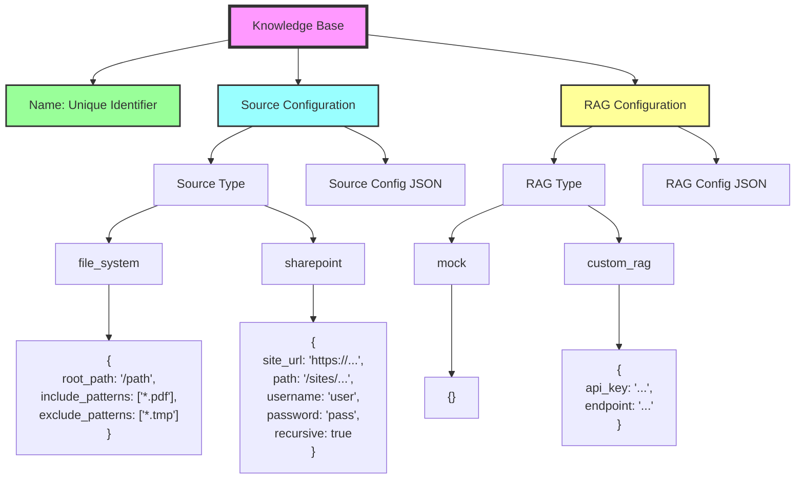
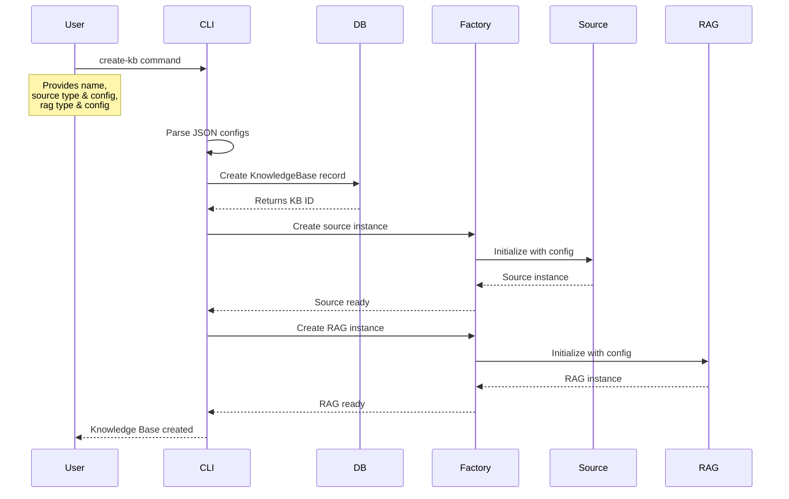

# Knowledge Base Configuration Diagram



## Configuration Flow



## Configuration Examples

### File System Configuration

```json
{
  "root_path": "/data/documents",
  "include_patterns": [
    "*.pdf",
    "*.docx",
    "*.md",
    "*.txt"
  ],
  "exclude_patterns": [
    "*.tmp",
    "~*",
    ".*",
    "__pycache__/**",
    ".git/**"
  ]
}
```

### SharePoint Configuration

```json
{
  "site_url": "https://company.sharepoint.com",
  "path": "/sites/ProjectX/Shared Documents",
  "username": "user@company.com",
  "password": "${SHAREPOINT_PWD}",
  "recursive": true
}
```

### Mock RAG Configuration

```json
{}
```

### Future RAG Configuration Examples

```json
// OpenAI RAG
{
  "api_key": "${OPENAI_API_KEY}",
  "model": "gpt-4",
  "chunk_size": 1000,
  "overlap": 200
}

// Custom RAG API
{
  "endpoint": "https://api.company.com/rag",
  "api_key": "${CUSTOM_API_KEY}",
  "timeout": 30,
  "batch_size": 10
}
```