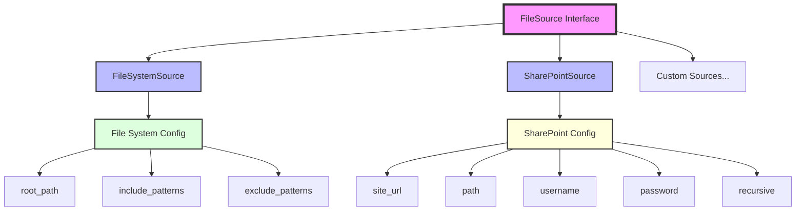
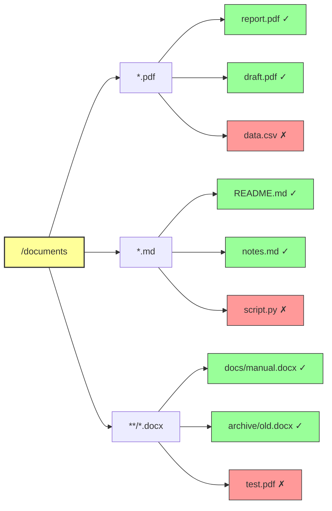
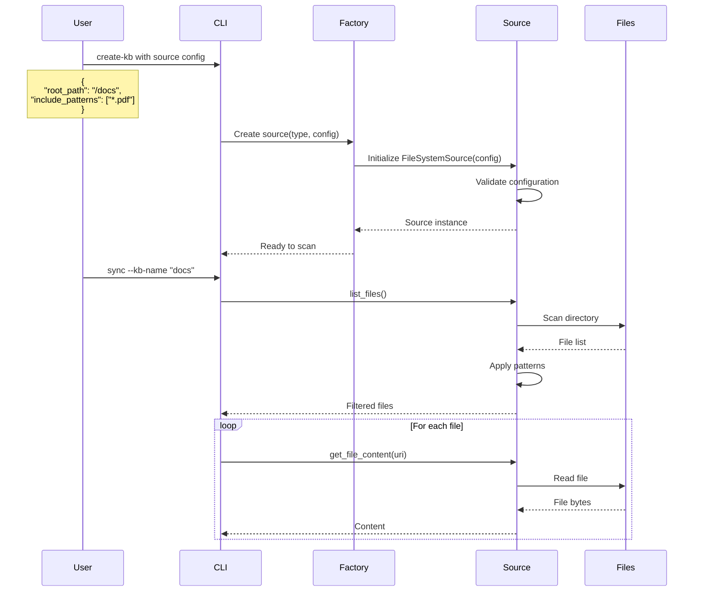

# Source Configuration Diagrams

## Source Type Hierarchy



## File System Source Pattern Matching



## SharePoint Source Structure

```mermaid
graph TD
    SP[SharePoint Site]
    SP --> SITES[/sites]
    SITES --> TEAM[/TeamSite]
    TEAM --> SHARED[/Shared Documents]
    SHARED --> FOLDER1[/Projects]
    SHARED --> FOLDER2[/Policies]
    SHARED --> FILE1[report.pdf]
    SHARED --> FILE2[guidelines.docx]
    
    FOLDER1 --> PROJ1[/ProjectA]
    FOLDER1 --> PROJ2[/ProjectB]
    PROJ1 --> FILE3[specs.pdf]
    PROJ1 --> FILE4[design.docx]
    
    FOLDER2 --> FILE5[hr_policy.pdf]
    FOLDER2 --> FILE6[it_policy.pdf]
    
    style SP fill:#f9f,stroke:#333,stroke-width:4px
    style SHARED fill:#9ff,stroke:#333,stroke-width:2px
    style FOLDER1 fill:#ff9,stroke:#333,stroke-width:2px
    style FOLDER2 fill:#ff9,stroke:#333,stroke-width:2px
```

## Configuration Flow



## Pattern Examples

### Include Pattern Matching

```
Pattern: *.pdf
Matches:
  ✓ document.pdf
  ✓ report.pdf
  ✗ document.docx
  ✗ folder/document.pdf

Pattern: **/*.pdf
Matches:
  ✓ document.pdf
  ✓ folder/document.pdf
  ✓ deep/folder/structure/file.pdf
  ✗ document.docx

Pattern: docs/*.md
Matches:
  ✓ docs/README.md
  ✓ docs/guide.md
  ✗ README.md
  ✗ docs/subfolder/guide.md

Pattern: **/README.*
Matches:
  ✓ README.md
  ✓ README.txt
  ✓ docs/README.md
  ✓ src/components/README.tsx
```

### Exclude Pattern Matching

```
Pattern: .*
Excludes:
  ✓ .gitignore
  ✓ .env
  ✗ README.md

Pattern: **/node_modules/**
Excludes:
  ✓ node_modules/package/file.js
  ✓ src/node_modules/lib/index.js
  ✗ src/index.js

Pattern: *.tmp
Excludes:
  ✓ document.tmp
  ✓ ~$document.docx
  ✗ document.pdf
```

## Configuration Matrix

| Source Type | Required Fields | Optional Fields | Default Values |
|-------------|----------------|-----------------|----------------|
| file_system | root_path | include_patterns<br>exclude_patterns | include: ["*"]<br>exclude: [] |
| sharepoint | site_url<br>path<br>username<br>password | recursive | recursive: true |

## Common Configuration Patterns

### 1. Document Processing
```json
{
  "root_path": "/documents",
  "include_patterns": [
    "*.pdf",
    "*.doc*",
    "*.xls*",
    "*.ppt*"
  ],
  "exclude_patterns": [
    "~$*",
    "*.tmp",
    "draft_*"
  ]
}
```

### 2. Code Documentation
```json
{
  "root_path": "/project",
  "include_patterns": [
    "**/*.md",
    "**/README*",
    "docs/**"
  ],
  "exclude_patterns": [
    "**/node_modules/**",
    "**/.git/**",
    "**/dist/**",
    "**/build/**"
  ]
}
```

### 3. Media Library
```json
{
  "root_path": "/media",
  "include_patterns": [
    "**/*.jpg",
    "**/*.png",
    "**/*.mp4",
    "**/*.pdf"
  ],
  "exclude_patterns": [
    "**/.thumbnails/**",
    "**/temp/**"
  ]
}
```

### 4. SharePoint Team Site
```json
{
  "site_url": "https://company.sharepoint.com",
  "path": "/sites/Marketing/Shared Documents",
  "username": "service_account@company.com",
  "password": "${SP_PASSWORD}",
  "recursive": true
}
```